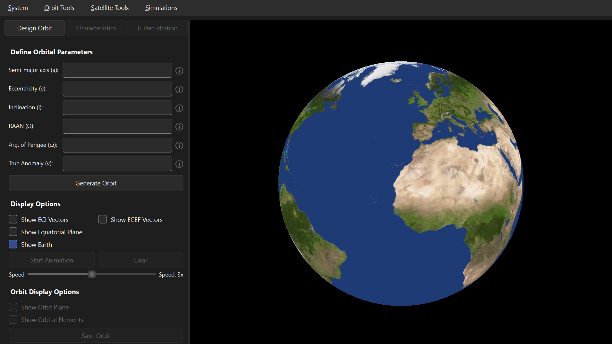
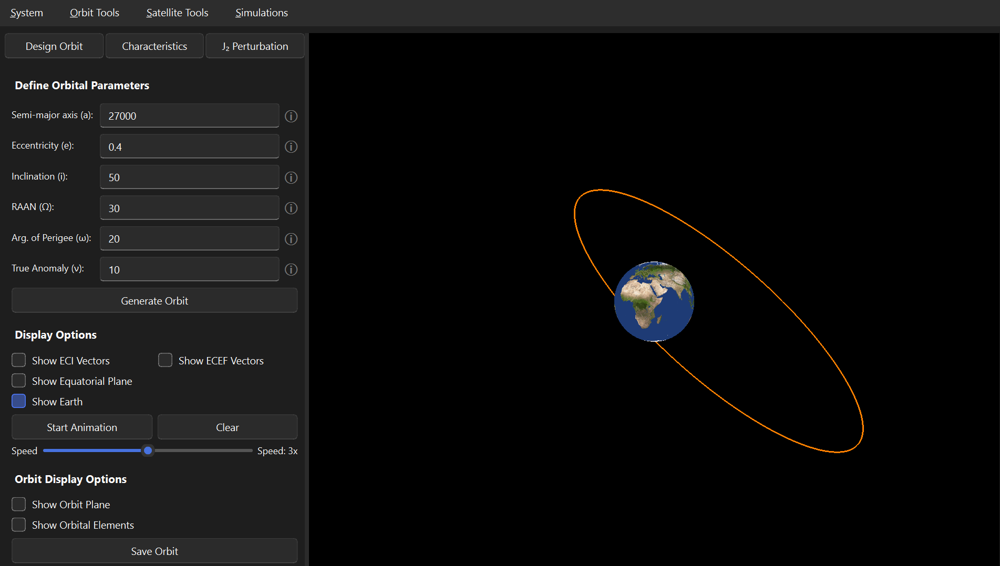
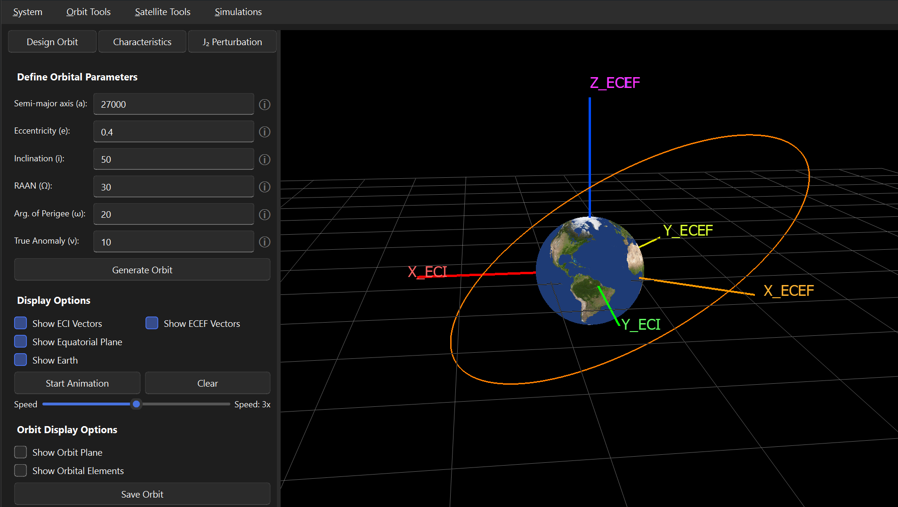
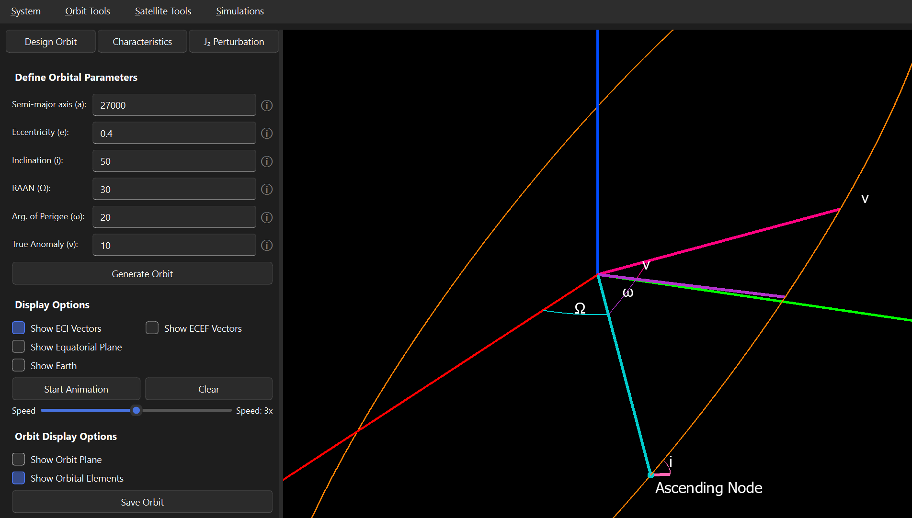
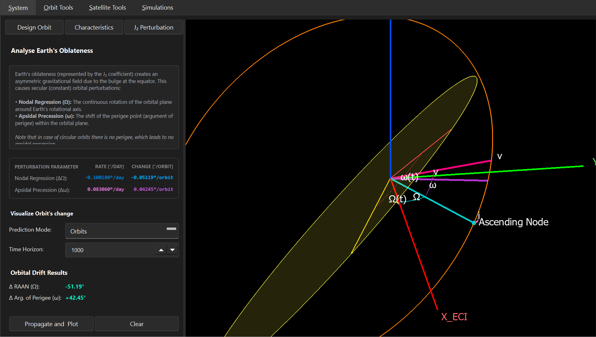
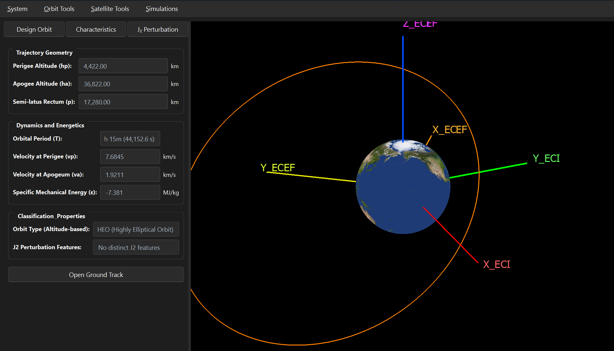
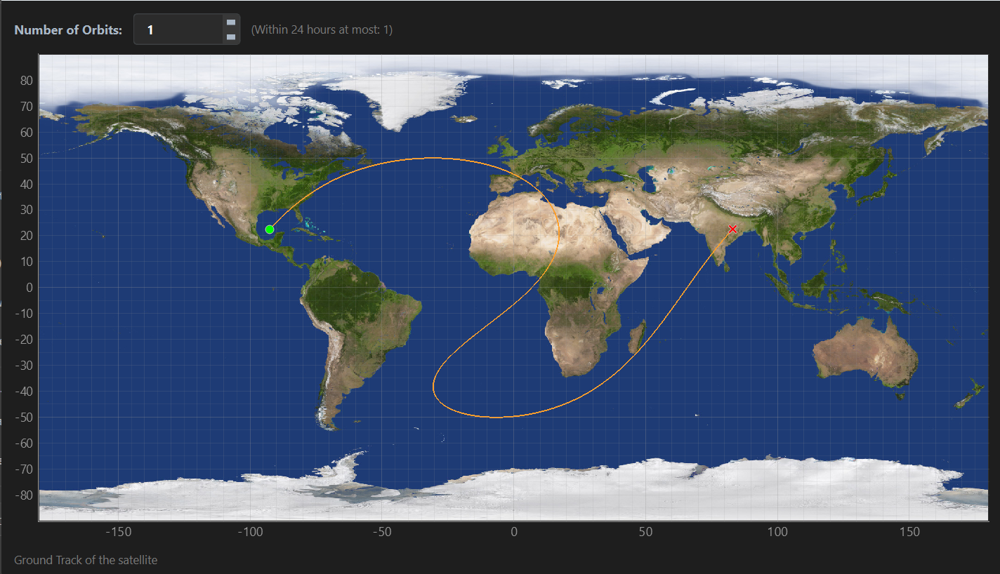

# Satware Simulations

Satware Simulations is an advanced desktop environment designed for real-time modeling, analysis, and simulation of space missions. The software enables orbit design, physical and hardware satellite configuration, and full 6-DOF (translational and rotational) attitude dynamics simulations featuring active ADCS algorithms and LEO environmental disturbance models.

---

## Key Features

### 1. Orbit Designer
* **Orbit Generation:** Define custom trajectories using classical Keplerian orbital elements.
* **3D Visualization:** Render Earth mesh, orbital and equatorial planes, alongside ECI and ECEF reference frame coordinate vectors.
* **Characteristics & Classification:** Analyze trajectory geometry, energy dynamics, and orbit classification (LEO, MEO, HEO, Sun-Synchronous, Molniya) alongside $J_2$ perturbation properties.
* **Pre-defined Profiles:** Load saved custom JSON files or pre-configured orbits (e.g., ISS, Molniya).

### 2. Satellite Configurator
* **Mechanical Modeling:** Define mass, rectangular dimensions, inertia tensors and magnetic dipole parameters.
* **Actuator Setup:** Configure Reaction Wheel assemblies and magnetorquer parameters.
* **Profile Management:** Save and load full satellite hardware configurations using JSON files.

### 3. Simulation Engine
* **6-DOF Dynamics:** Perform numerical integration of equations of motion with customizable integration time steps.
* **Disturbance Models:**
  * $J_2$ gravitational perturbations.
  * Gravity Gradient torque.
  * Atmospheric Drag using NRLMSISE-00 with dynamic CoP/CoM offset and Earth rotation effects.
* **ADCS Algorithms:** Active attitude control testing, including B-dot detumbling and Reaction Wheel momentum management.
* **Real-time Telemetry & Plots:** Real-time 3D motion playback (with pause/speed controls) and customizable plotting interface (up to 3 simultaneous plots).

---

## Prerequisites & Installation

### System Requirements
* **Python:** 3.12.6 
* **Operating System:** Windows / Linux (mainly tested on Windows)

### 1. Clone the Repository
```
git clone https://github.com/Luki10011/SatwareSimulations.git
```

### 2. Create virtual environment
```[bash]
python -m venv .venv
.venv\Scripts\activate
```

### 3. Install required dependecies
```
pip install --upgrade pip
pip install -r requirements.txt
```

---

## Running the Application
```
python -m main
```

---

## User Manual

Whole system functionalities are devided into three functional modules: 
- Orbit Designer,
- Satellite Configurator,
- Simulation Engine.

In this section inctructions on how to use the software will be listed. 

### Orbit Designer

---

First step during the mission planning is to design an orbit. In order to do that it is recommeneded to use a specfic tool. In `Satware Simulations` the Orbit Designer functional module is responsible for that. To create a new orbit, you can use it through drop-down menu or quick access field.


After entering the module the default state will be presented. As in the figure below.



An orbit is decribed by the keplerian elements: semi-major axis, eccentricty, inclination, RAAN, argument of perigee and true anomaly. In order to generate the orbit, some predefined conditions need to be satisfied. For each orbital parameter there is an ,,i'' icon, which describes the allowed range. When everything is correct, an orbit can be genereted.



Then user is allowed to use the series of additional functionalites for the analysis of the orbit. 

#### Display Options 
- Show ECI Vectors,
- Show ECEF Vectors, 
- Show Equatorial Plane,
- Show Earth.



#### Orbit Display Options 

- Show Orbit Plane,
- Show Orbital Elements.



  User has an option to analyze the J2 perterubation effects in the ,,J2 Perturbation'' tab. After declaring the anlysis period the perturbated orbit is displayed with new argument of perigee and RAAN.

  

The last tab in the Orbit Designer functional module is ,,Characteristics''. It is responsible for summaring the created orbit with the display of following informations:

- Trajectory Geometry
  - Perigee Altitude [km],
  - Apogee Altitude [km],
  - Semi-latus Rectum [km].
- Dynamics and Energetics
  - Orbital Period [HH:MM (SS)],
  - Velocity at Perigee [km/s],
  - Velocity at Apogee [km/s],
  - Specific Mechanical Energy [MJ/kg],
- Classification Properties
  - Orbit Type (Altitude-based),
  - J2 Perturbation Features.



Additional funtionality in the ,,Characteristics'' tab is the visualisation of satellite's ground track. User is able to plot it in function of the number of orbits (within 24h time).




